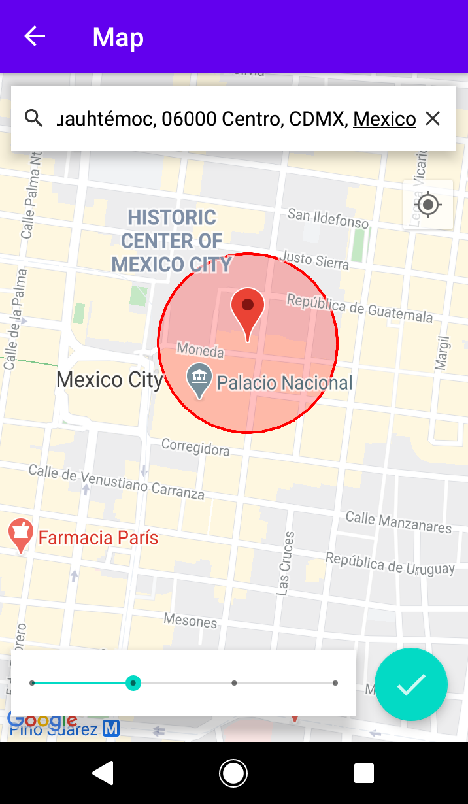

# Connectivity Geofences

## Description
Android app that allows the user to set the locations where the Wi-Fi or the Bluetooth should be turned off or on.

## Setup Development Enviroment
- Android Studio

- Android SDK Tools

- Compile SDK version 29

- Build Tools 29.0.2

- Target SDK 29

- Min SDK 24

- You need your own Google Maps Api Key

## Screenshots

